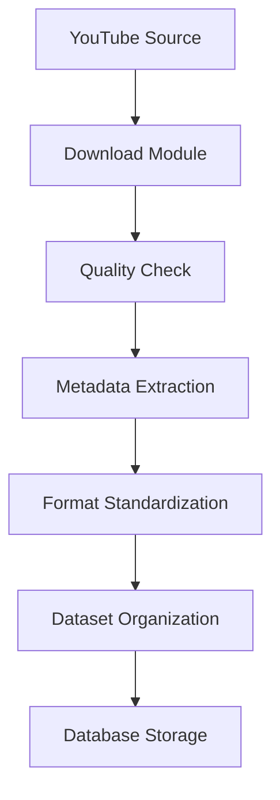

# MAESTRO.ai - Phase 1: Data Pipeline & Preprocessing

## Overview
Phase 1 implements a robust data collection and preprocessing pipeline for audio processing. This phase focuses on gathering high-quality audio data, standardizing formats, and preparing the dataset for further processing.

## Setup

### Prerequisites
```bash
# System Dependencies

cd MusicDownload
python -m venv env
source env/bin/activate
brew install ffmpeg libsndfile
pip install -r ../requirements.txt

# or for Ubuntu/Debian

cd MusicDownload
python -m venv env
source env/bin/activate
sudo apt-get install ffmpeg libsndfile1-dev
pip install -r ../requirements.txt

# or for windows

# OOPS: We don't do that here✌🏻
```

Usage
Basic Commands
To run the complete pipeline:

```
python optimized_pipeline.py --config config.json --project-dir .
```

Skipping Phases - 
The pipeline allows skipping specific phases for greater flexibility:

1. Skip Download Phase:

```
python optimized_pipeline.py --config config.json --project-dir . --skip download
```

Skip Multiple Phases:

```
python optimized_pipeline.py --config config.json --project-dir . --skip download features
```

Other Combinations:
```
# Skip only feature extraction:
python optimized_pipeline.py --config config.json --project-dir . --skip features
# Skip metadata extraction:
python optimized_pipeline.py --config config.json --project-dir . --skip metadata
# Skip features and metadata:
python optimized_pipeline.py --config config.json --project-dir . --skip features
```



