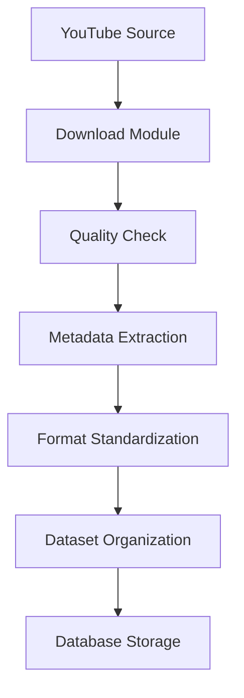

# MAESTRO.ai - Phase 1: Data Pipeline & Preprocessing

## Overview
Phase 1 implements a robust data collection and preprocessing pipeline for audio processing. This phase focuses on gathering high-quality audio data, standardizing formats, and preparing the dataset for further processing.

## Table of Contents
- [Setup](#setup)
- [Data Pipeline Architecture](#data-pipeline-architecture)
- [Features](#features)
- [Usage](#usage)
- [Directory Structure](#directory-structure)
- [Quality Control](#quality-control)
- [Configuration](#configuration)
- [Troubleshooting](#troubleshooting)

## Setup

### Prerequisites
```bash
# System Dependencies
brew install ffmpeg libsndfile   # macOS
# or
sudo apt-get install ffmpeg libsndfile1-dev   # Ubuntu/Debian

# Python Environment
python -m venv env
source env/bin/activate
pip install -r requirements.txt
```

### Installation Verification
```python
from data_pipeline import AudioDataPipeline
pipeline = AudioDataPipeline()
print(pipeline.get_dataset_stats())
```

## Data Pipeline Architecture



## Features

### 1. Data Collection
- Integrated YouTube playlist downloading
- Multi-format audio support
- Concurrent download capabilities
- Progress tracking and logging

### 2. Quality Control
- Audio quality metrics analysis
- Format validation
- Duration checks
- Sample rate verification
- Amplitude analysis
- Metadata validation

### 3. Metadata Management
- Comprehensive metadata extraction
- SQLite database storage
- Structured data organization
- Statistical analysis capabilities

### 4. Format Standardization
- Sample rate conversion
- Channel standardization
- Format normalization
- Quality preservation checks

## Usage

### Basic Usage
```python
from data_pipeline import AudioDataPipeline

# Initialize pipeline
pipeline = AudioDataPipeline()

# Process a YouTube playlist
pipeline.process_download(
    playlist_url="https://www.youtube.com/playlist?list=YOUR_PLAYLIST_ID",
    genre="electronic"
)
```

### Advanced Usage
```python
# Custom configuration
config = {
    "target_sample_rate": 44100,
    "target_channels": 2,
    "min_duration": 30,
    "max_duration": 600,
    "min_quality_score": 0.7
}

pipeline = AudioDataPipeline(config_path="custom_config.json")

# Process multiple playlists
playlists = [
    ("playlist_url_1", "genre_1"),
    ("playlist_url_2", "genre_2")
]

for url, genre in playlists:
    pipeline.process_download(url, genre)
```

## Directory Structure
```
dataset/
├── raw/
│   └── downloads/
│       └── YYYYMMDD_HHMMSS/
├── processed/
│   ├── train/
│   ├── validation/
│   └── test/
└── metadata/
    ├── audio_metadata.db
    └── processing_logs/
```

## Quality Control

### Audio Quality Metrics
- **Sample Rate**: Minimum 44.1kHz
- **Bit Depth**: 16-bit minimum
- **Duration**: 30s to 10m
- **Quality Score Components**:
  - Peak amplitude
  - DC offset
  - RMS levels
  - Dynamic range
  - Phase correlation

### Quality Scoring System
```python
Quality Score = Base Score (1.0)
    * Duration Factor (0.5-1.0)
    * Sample Rate Factor (0.7-1.0)
    * Amplitude Factor (0.6-1.0)
    * DC Offset Factor (0.8-1.0)
```

## Configuration

### pipeline_config.json
```json
{
    "target_sample_rate": 44100,
    "target_channels": 2,
    "min_duration": 30,
    "max_duration": 600,
    "min_quality_score": 0.7,
    "target_formats": ["mp3", "wav"],
    "split_ratio": {
        "train": 0.8,
        "validation": 0.1,
        "test": 0.1
    }
}
```

### Quality Thresholds
```json
{
    "quality_thresholds": {
        "min_peak_amplitude": 0.1,
        "max_dc_offset": 0.01,
        "min_rms": -40,
        "max_rms": -12
    }
}
```

## Troubleshooting

### Common Issues

1. **FFmpeg Not Found**
```bash
# Solution
brew install ffmpeg  # macOS
sudo apt-get install ffmpeg  # Ubuntu
```

2. **Library Issues**
```bash
# Solution for libsndfile errors
brew install libsndfile  # macOS
sudo apt-get install libsndfile1-dev  # Ubuntu
```

3. **Permission Issues**
```bash
# Solution
chmod -R 755 dataset/
```

### Error Handling
- Download failures are logged and retried
- Corrupted files are automatically removed
- Low-quality files are flagged for review
- All operations are logged for debugging

## Next Steps
1. Run the pipeline verification script
2. Monitor dataset growth
3. Review quality metrics
4. Adjust configuration as needed
5. Proceed to Phase 2 (Style Analysis)

## Contributing
Please read [CONTRIBUTING.md](CONTRIBUTING.md) for details on our code of conduct and the process for submitting pull requests.

## License
This project is licensed under the MIT License - see the [LICENSE](LICENSE) file for details.
