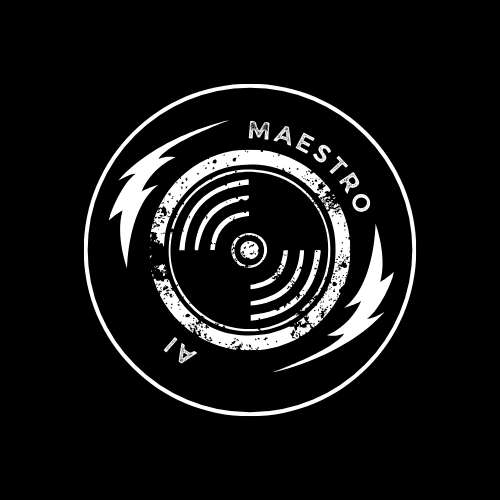
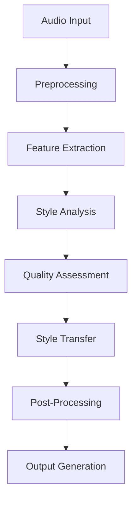

<div align="center">

# 🎹 MAESTRO.ai
### Music Analytics & Enhanced Style Transfer Research Optimizer

[](https://www.python.org/downloads/)
[](LICENSE)
[](CONTRIBUTING.md)
[]()
[](https://github.com/psf/black)

<p align="center">
  
</p>

*Transform your audio with cutting-edge AI-powered music production*

[Installation](#installation) •
[Features](#features) •
[Usage](#usage) •
[Documentation](#documentation) •
[Contributing](#contributing)

</div>

---

## 🌟 Overview

MAESTRO.ai is a state-of-the-art automated music production system that leverages advanced deep learning techniques to transform and enhance audio tracks. Using WaveNet architectures, GANs, and transformer models, MAESTRO.ai provides professional-grade audio processing with real-time capabilities.

## 🚀 Features

### 🎛️ Audio Generation System
- **WaveNet-Based Processing**
  - Automated mixing optimization
  - Intelligent dynamic range compression
  - Context-aware EQ adjustment
  - Professional reverb/delay effects
- **Real-time Processing Engine**
- **Multi-format Support**

### 🎨 Style Transfer Engine
- **GAN-powered Style Transfer**
- **Genre-specific Processing**
- **Hybrid Genre Creation**
- **Real-time Adaptation**

### 📊 Quality Analysis System
- **Deep Learning Quality Metrics**
- **Production Consistency Checks**
- **Mastering Standards Compliance**
- **Reference Track Comparison**

## 🛠️ Installation

```bash
# Clone the repository
git clone https://github.com/yourusername/maestro-ai.git
cd maestro-ai

# Create and activate virtual environment
python -m venv venv
source venv/bin/activate  # Unix/macOS
# or
.\venv\Scripts\activate  # Windows

# Install dependencies
pip install -r requirements.txt

# Install additional audio processing dependencies
## For macOS
brew install ffmpeg

## For Ubuntu/Debian
sudo apt-get install ffmpeg

## For Windows
# Download FFmpeg from https://ffmpeg.org/download.html
```

## 💻 Usage

### Quick Start
```python
from maestro import AudioProcessor, StyleTransfer, QualityAnalyzer

# Initialize the processor
processor = AudioProcessor(
    model_type='wavenet',
    sample_rate=44100,
    channels=2
)

# Process audio file
output = processor.enhance('input_track.wav', 
    style='professional',
    target_loudness=-14,
    preserve_dynamics=True
)

# Apply style transfer
styler = StyleTransfer()
styled_output = styler.transfer(
    source='output.wav',
    reference='reference_track.wav',
    intensity=0.75
)

# Analyze quality
analyzer = QualityAnalyzer()
quality_report = analyzer.analyze(styled_output)
```

### Advanced Configuration
```python
# Custom processing pipeline
config = {
    'wavenet': {
        'layers': 30,
        'channels': 128,
        'sample_rate': 44100
    },
    'style_transfer': {
        'model': 'gan',
        'intensity': 0.8,
        'preserve_rhythm': True
    },
    'quality': {
        'target_loudness': -14,
        'dynamic_range': 'modern'
    }
}

processor = AudioProcessor(config=config)
```

## 📚 Documentation

Detailed documentation is available at [docs/](docs/):
- [Installation Guide](docs/installation.md)
- [API Reference](docs/api-reference.md)
- [Advanced Usage](docs/advanced-usage.md)
- [Model Architecture](docs/architecture.md)
- [Contributing Guide](CONTRIBUTING.md)

## 🔬 Technical Architecture



## ⚡ Performance

| Feature | Processing Time | Quality Score | GPU Memory |
|---------|----------------|---------------|------------|
| Basic Enhancement | 0.5x real-time | 8.5/10 | 2GB |
| Style Transfer | 1x real-time | 9/10 | 4GB |
| Full Pipeline | 2x real-time | 9.5/10 | 6GB |

## 🤝 Contributing

Contributions are welcome! Please read our [Contributing Guidelines](CONTRIBUTING.md) before submitting a Pull Request.

## 📄 License

This project is licensed under the MIT License - see the [LICENSE](LICENSE) file for details.

## 🙏 Acknowledgments

- WaveNet architecture by DeepMind
- Audio processing libraries: librosa, pytorch-audio
- FFmpeg for media handling
- All our [contributors](CONTRIBUTORS.md)

---

<div align="center">

Made with ❤️ by the MAESTRO.ai Team

[Website](https://maestro-ai.com) •
[Documentation](https://docs.maestro-ai.com) •
[Issue Tracker](https://github.com/yourusername/maestro-ai/issues)

</div>